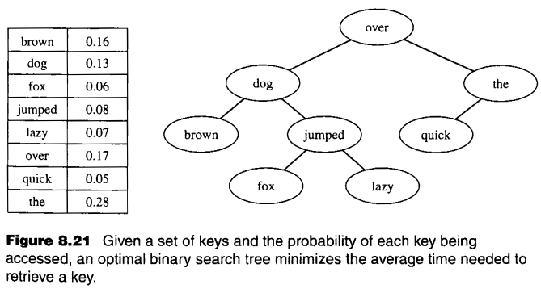

# Binary Search Tree

This exercise involves key retreival with probability. The exercise is given in page 213 of textbook(8.12). The problem is as follows:

A binary search tree is a way of organizing *n* keys from a linearly ordered set to ensure their retrieval in (log*n*) time. If we know the probability of each key being accessed, we can create an optimal binary search tree that minimizes the average search time.

Format: 
